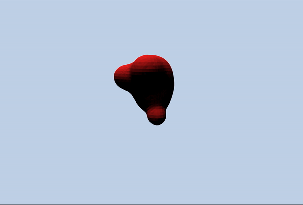
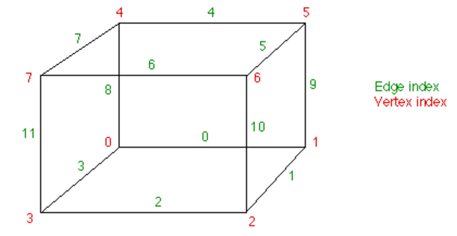

# Project 6: Implicit surfaces - Marching cubes

**Goal:** Implement metaballs using density functions with marching cubes algorithm. See [link]() for the ray marching version of this assignment.

We suggest the following resources before starting your assignment:

- [Generating complex terrain](https://developer.nvidia.com/gpugems/GPUGems3/gpugems3_ch01.html) from [GPU Gems 3](https://developer.nvidia.com/gpugems/GPUGems3/gpugems3_pref01.html).
- [Polygonising a scalar field](http://paulbourke.net/geometry/polygonise/) by Paul Bourke.
- [Marching squares](Metaball and Marching Squares) by Jamie Wong.

## Base code framework

We have provided a basecode as a reference. You are welcome to modify the framework for your project.

- _main.js_
  * `App`
This is a global configuration object. All information for the marching cubes are stored here. **Note**: `App.visualDebug` is a global control of all the visual debugging components. Even though it is helpful for development, it could be memory intensive. Toggle this flag off for better perforamance at high resolution.

_marching_cubes.js_:

  - `class MarchingCubes`:
    This class encapsulates everything about the metaballs, grid, voxels, and sampling information.

  - `class Voxel`:
    This class contains information about a single voxel, and its sample points. Polygonization happens here.

_inspect_point.js_:
  - `class InspectPoint`:
    This class simply contains a single sample point that can output its value on the screen at its pixel location.

_metaball.js_
  - `class Metaball`:
    This class represents a single metaball.

_marching_cube_LUT.js_:
This file contains the edge table and the triangle table for the marching cubes.

## Moving metaballs (5 points)

The `Metaball` class defines the position, velocity, and radius of a metaball. Implement its `update` function to start moving them around. Make sure to handle boundaries such that the balls will not reach close the grid's edges. This could interfere with polygonization later on. We suggest keeping a margin.

### Sampling at corners (5 points)
At each frame update, compute the sample values for all corners of a voxel.

## Polygonization (50 points)
Implement `polygonize` inside `Cell` class. This function should return the list of vertices and normals of the triangles generated from the voxel. The table assumes the following voxel's indexing scheme:

Using 8-bit, each corner that has an isovalue above the isolevel can be represented as a 1. 

### Vertices (30 points)

To compute the vertices, we have provided the look-up tables from Paul Bourke's.

- **EDGE_TABLE**: This table returns a 12-bit index that represents the edges intersected by the isosurface. An edge is intersected if its bit is 1. For each intersected edge, compute the linearly interpolated vertex position on the edge according to the isovalue at each end corner of the edge.

- **TRI_TABLE**: This table acts as the triangle indices. Every 16 elements in the table represents a possible polygonizing configuration. Within each configuration, every three consecutive elements represents the indices of a triangle that should be created from the edges above. 

### Normals (20 points)

Compute the normals using the gradient of the vertex with respect to the x, y, and z.

## Meshing (20 points)

Now that you have obtained a list of 'vertices' and 'normals' from each voxel, implement `makeMesh` and `updateMesh` in class `MarchingCubes` to generate the mesh once and update its geometry each frame.

## Materials/Post-processing (10 points)

Interesting shader materials beyond just the provided threejs materials. We encourage using your previous shaders assignment for this part.

## Custom scene (10 points)

The density function isn't restricted to just metaball. Implement other none-spherical surfaces (for example: planes, mesh, etc.). Implement a GUI dropdown for switching between metaballs and your custom scene.

## Submission

- Update `README.md` to contain a solid description of your project
- Publish your project to gh-pages. `npm run deploy`. It should now be visible at http://username.github.io/repo-name
- Create a [pull request](https://help.github.com/articles/creating-a-pull-request/) to this repository, and in the comment, include a link to your published project.
- Submit the link to your pull request on Canvas.

